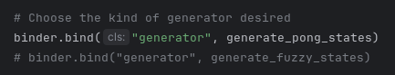

# pong_model
The dumbest game you might ever play
## Installation
1. Create a virtual environment  
`python -m venv .venv`


2. Activate the environment  
`source .venv/bin/active`


3. If installing for AMD GPU training/inference
   1. `pip install -r requirements-rocm.txt`
   2. For MI100 gpu, 
      1. clone flash attention repo if using flash attention and install  
      ```git clone https://github.com/Dao-AILab/flash-attention.git  dependencies/flash-attention```
      2. Navigate to flash_attention direcotry  
      ```cd dependecies/flash_attention```
      2. Install using ROCm environment  
      ```export GPU_ARCHS=gfx908 && rocm-python setup.py install```


4. Install all other dependencies  
`pip install -r requirements.txt`

## Model configuration
To adjust model parameters, update the model_configuration.py

If no GPU, be sure to set `device` to `cpu`

## Training
Run the training script to generate a model  
`python trainer.py`

## Test the model
Run the main script with desired generator
1. engine - generates states computed mathematically
2. fuzzy_engine - generates states using model trained on states generated from engine

Update main.py to use the desired generator  
  

then run the main script  
`python main.py`

## Todo
- [ ] Capture metrics for model performance during training  
- [x] Include bounding box collisions in the input data  
- [x] separate paddle control and scoring from ball engine
- [ ] enable user control of paddles
- [x] introduce variability in generator to paddle movements  
- [ ] limit ball vector to certain degrees  
- [ ] provide extreme negative feedback the further ball goes out of bounds during training  
- [ ] provide extreme negative feedback for ball moving slowly or not at all  
- [ ] try out a couple different model architectures to see which might start to provide usable results
- [x] predict score (continuous integer mse) and hits as well (binary state cross-entropy)
- [ ] make sure all inputs to the model are standardized
  - currently position information is between 0 and 1 whereas velocity is between -1 and 1
- [ ] create separate training configuration file
  - include options to adjust generated paddle velocities to control even data generation
- [ ] introduce variability configuration setting for models to produce more unpredictable output
- [ ] Let the model control scaling factor of the game for extra glitchy experience
- [ ] Consider how to make the model control arbitrary number of balls...
- [ ] Create common loop for fuzzy and exact engines (mainly paddle control)
- [ ] Train the model on resetting the game when best of X reached